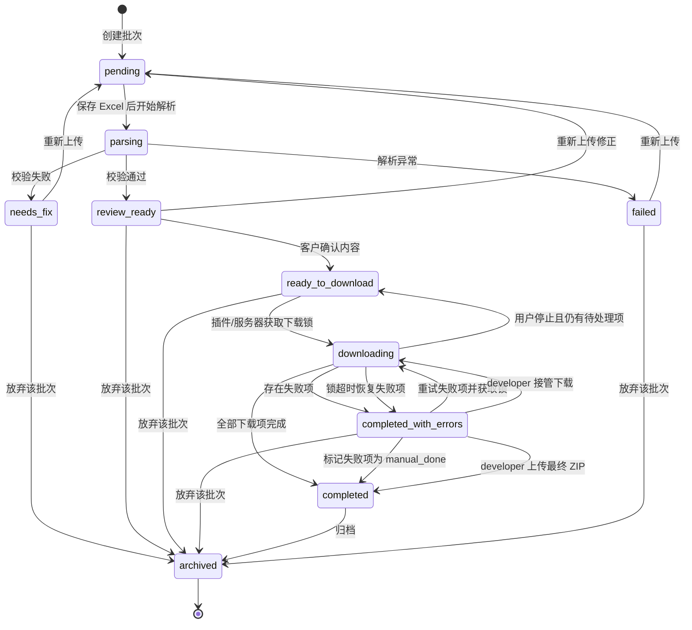
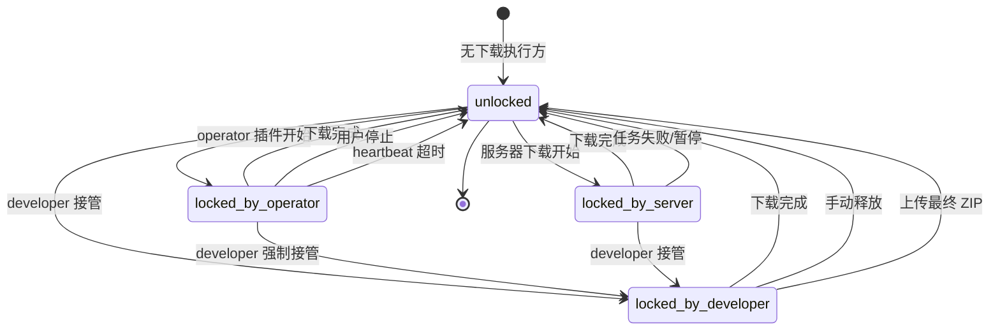
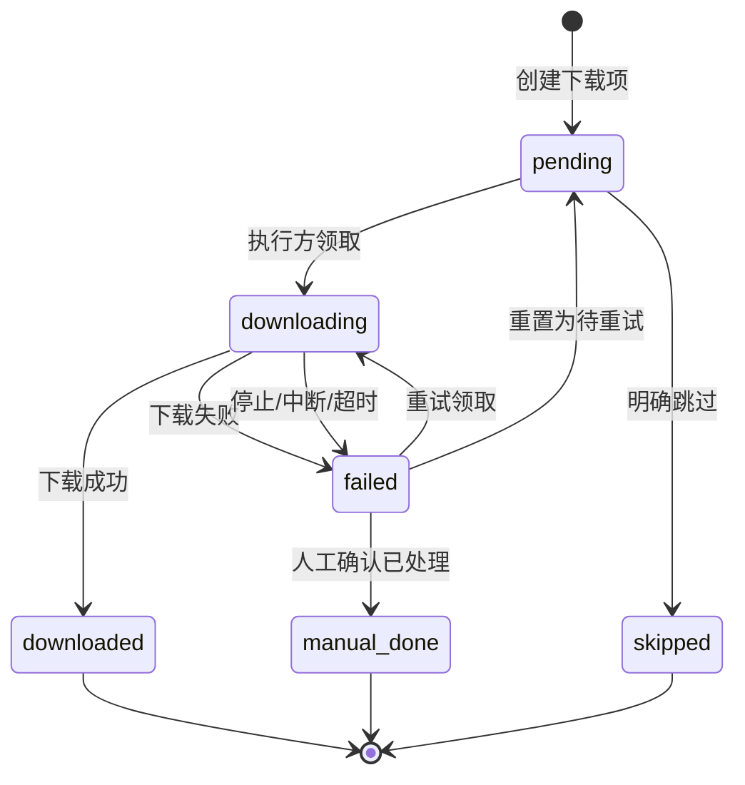

# 批次状态机设计 v1

## 1. 目标

本文档定义第一版 Web 下图工具的批次级状态流转，覆盖：

- 客户上传 Excel。
- 系统解析和基础校验。
- 客户确认识别结果。
- 插件或服务器开始下载。
- 下载失败、重试、开发者接管。
- 最终 ZIP 交付和归档。

本文档补充现有状态文档：

- `STATUS_MODEL.md`：长期订单、图片、履约和物流状态模型。
- `BROWSER_EXTENSION_STATE_MACHINE_V1.md`：浏览器插件运行状态机。

核心原则：

- `import_batches.status` 表示批次处在业务流程哪一步。
- `download_items.status` 表示每个链接下载成没成。
- 下载锁表示当前由谁处理该批次，避免多人同时下载。
- 插件自己的 `phase` 继续按 `BROWSER_EXTENSION_STATE_MACHINE_V1.md` 管理。

## 2. 角色

| 角色 | 说明 |
|---|---|
| `developer` | 开发者/维护者，最高权限，可查看全部批次、强制解锁、接管下载、上传结果 ZIP。 |
| `admin` | 管理员，可查看团队批次、协助业务员处理问题。第一版可先预留。 |
| `operator` | 业务员，只能上传和处理自己账号下的批次。 |

第一版如果暂不实现 `admin`，可以先只落地：

```text
developer
operator
```

## 3. 批次状态

| 状态 | 中文 | 含义 |
|---|---|---|
| `pending` | 等待处理 | 批次已创建，文件保存中或等待解析。 |
| `parsing` | 解析中 | 系统正在解析 Excel 并生成下载项。 |
| `needs_fix` | 需修正 | 基础校验未通过，不能进入下载。 |
| `review_ready` | 待确认 | 校验通过，等待客户检查识别结果。 |
| `ready_to_download` | 可下载 | 客户已确认内容，可以开始下载。 |
| `downloading` | 下载中 | 有执行方正在处理该批次。 |
| `completed_with_errors` | 有失败项 | 下载结束但存在失败项，需要重试、接管或人工处理。 |
| `completed` | 已完成 | 没有待处理项，结果 ZIP 可交付。 |
| `failed` | 系统失败 | 解析或系统级任务失败。 |
| `archived` | 已归档 | 批次不再处理，仅保留记录。 |

当前实现已有：

```text
pending
parsing
needs_fix
review_ready
downloading
completed_with_errors
completed
failed
```

建议新增：

```text
ready_to_download
archived
```

如果第一版暂不修改数据库状态枚举，可以先用独立字段记录“客户已确认”，并继续让 `review_ready` 表示可开始下载。

## 4. 下载项状态

| 状态 | 中文 | 含义 |
|---|---|---|
| `pending` | 待下载 | 下载项已生成，尚未开始。 |
| `downloading` | 下载中 | 某个执行方已领取该项。 |
| `downloaded` | 已下载 | 下载成功，并记录文件。 |
| `failed` | 失败 | 下载失败，可重试或人工处理。 |
| `skipped` | 已跳过 | 明确不需要下载。 |
| `manual_done` | 手动完成 | 人工确认已处理。 |

下载项状态是单个链接的事实记录。批次状态应根据下载项汇总结果更新，但不能替代下载项状态。

## 5. 下载锁

同一批次同一时间只能有一个下载执行方。

建议锁字段：

```text
lock_owner_user_id
lock_owner_role
lock_type: plugin | server | developer_takeover | manual
locked_at
last_heartbeat_at
lock_expires_at
```

锁规则：

- 启动插件下载前必须先获取批次锁。
- 获取失败时提示当前由谁处理。
- 下载完成、停止、超时后释放锁。
- `developer` 可以强制解锁并接管。
- 锁只表示“谁正在处理批次”，不替代批次状态。

## 6. 批次状态机



## 7. 下载锁状态机



## 8. 下载项状态机



## 9. 核心规则

- 表格校验失败时不能开始下载。
- 客户确认前不建议自动下载，避免解析错误直接进入执行。
- 下载失败不建议重新上传新批次，优先在原批次重试或由开发者接管。
- 只有表格内容错误、解析规则变化、或客户明确重发时才创建新批次。
- `developer` 接管不改变批次归属，客户仍可在自己的账号下查看和下载结果。
- 最终 ZIP 可以由系统生成，也可以由 `developer` 手动上传绑定到原批次。

## 10. 测试场景

- 上传合法 Excel 后进入 `review_ready`，确认后进入 `ready_to_download`。
- 上传缺少 SKU 或 Design Link 的 Excel 后进入 `needs_fix`，下载按钮禁用。
- 同一批次已有锁时，第二个插件不能启动下载。
- `developer` 可以强制接管已锁定或失败批次。
- 下载项全部成功后批次进入 `completed`。
- 存在失败项时批次进入 `completed_with_errors`。
- `manual_done` 清空所有失败项后批次进入 `completed`。
- `operator` 只能查看自己的批次，`developer` 可以查看全部批次。

## 11. 后续实现备注

第一版可以按最小改动落地：

- 先保留当前批次状态，只新增“确认后可下载”的概念。
- 下载锁可以先作为批次字段或独立表实现，优先保证互斥。
- `developer` 接管先服务于排障和交付，不强求客户理解锁细节。
- 状态变化后续应写入事件或日志，避免只覆盖当前状态导致排障困难。
